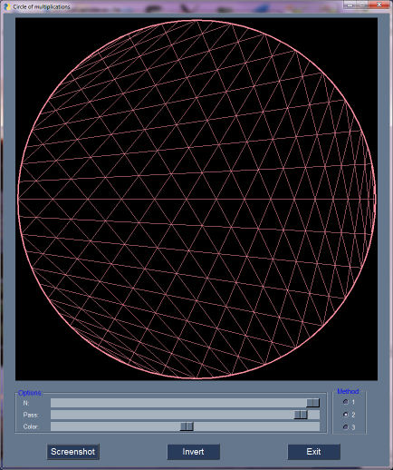
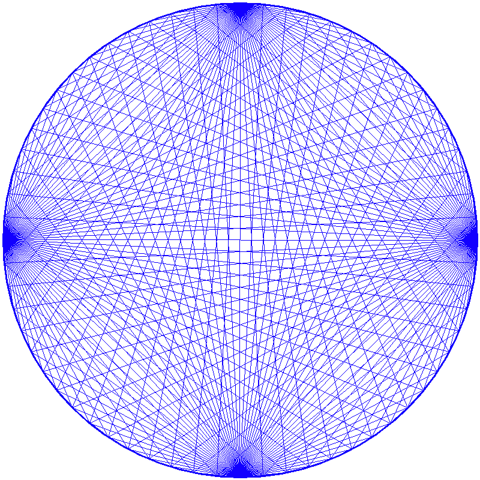

# circlesmul
Circle of multiplication

Worked program looks like this:

You can save screenshot of by pressing corresponding button.

Some screenshots:

## Requirements:

* Python
* NumPY
* OpenCV
* PySimpleGUI

## Files:
	
* [circlesmul.py](circlesmul.py) - Main program
* README.md - This readme file
* LICENSE - GNU GENERAL PUBLIC LICENSE

# AUTHOR
   An0ther0ne
   