# circlesmul
Circle of multiplication

Worked program looks like this:

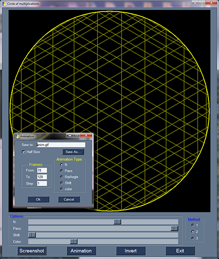

You can save screenshot or GIF animation by pressing corresponding button.

Some screenshots:

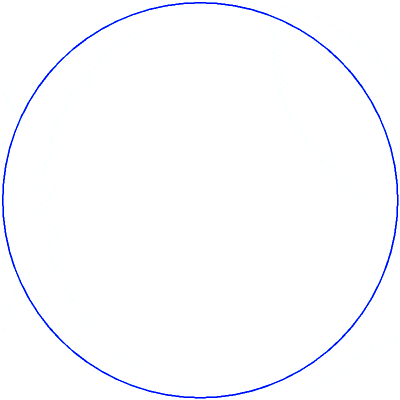
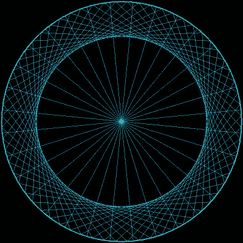
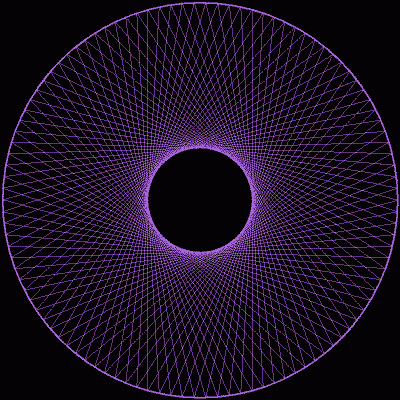
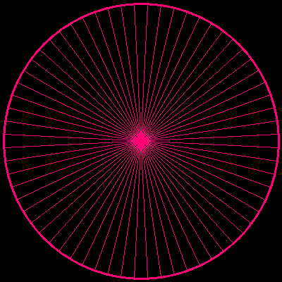
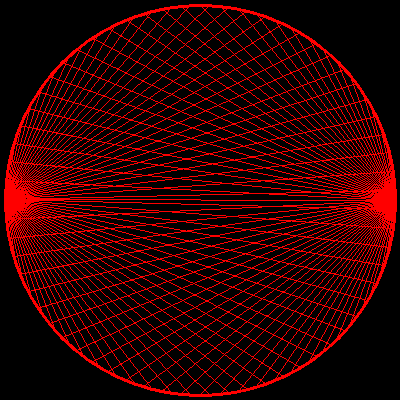
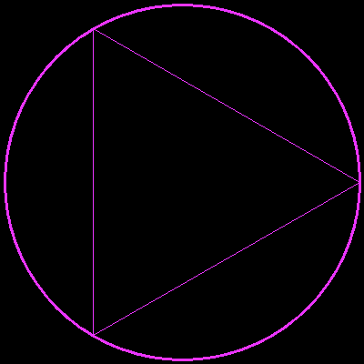
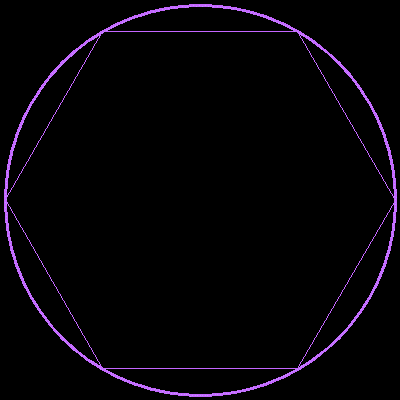
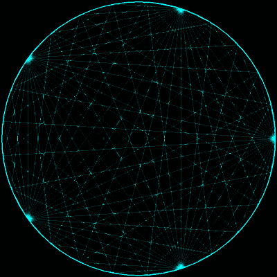
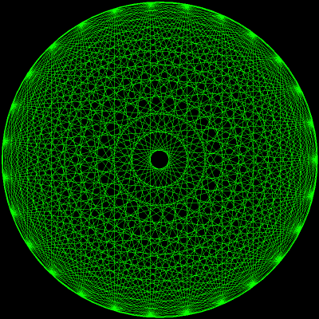
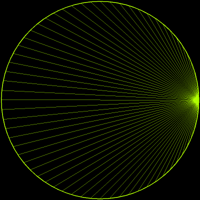
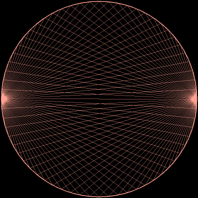
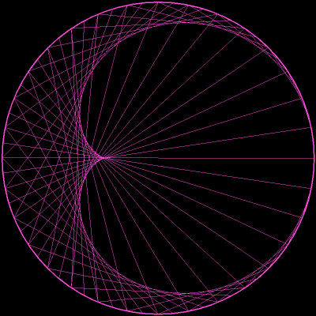
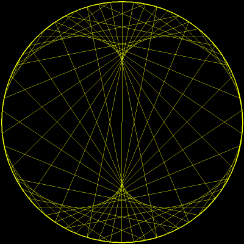
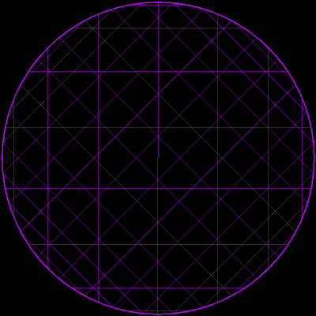
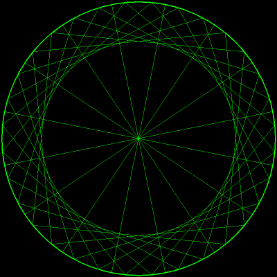
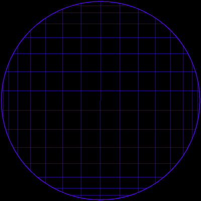
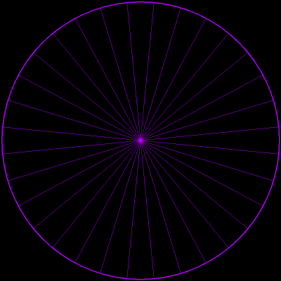
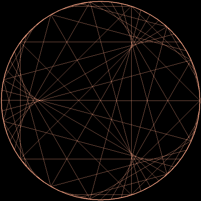
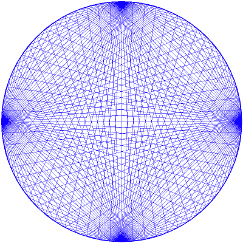
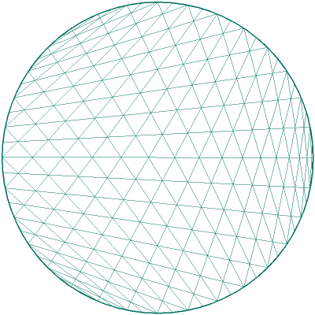

## Requirements:

* Python
* NumPY
* OpenCV
* PySimpleGUI
* Pillow (for save to GIF feature)

## Files:
	
* [circlesmul.py](circlesmul.py) - Main program
* [pylint.config](pylint.config) - My custom PyLint-er config file for this project
* README.md - This readme file
* LICENSE - GNU GENERAL PUBLIC LICENSE

# AUTHOR
   An0ther0ne
   